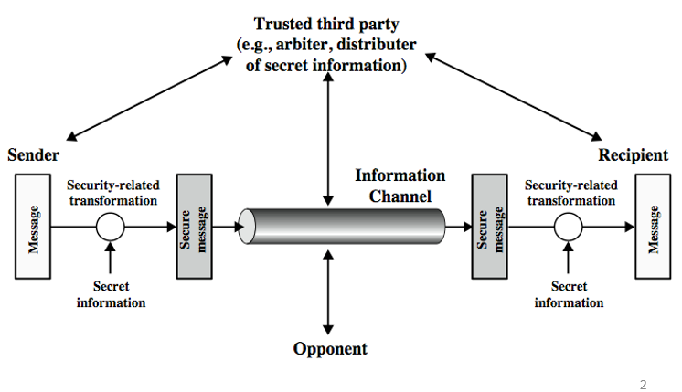
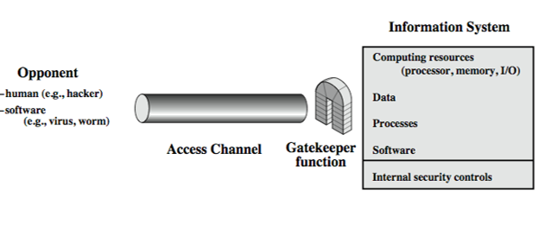
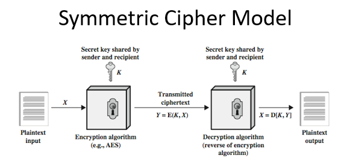
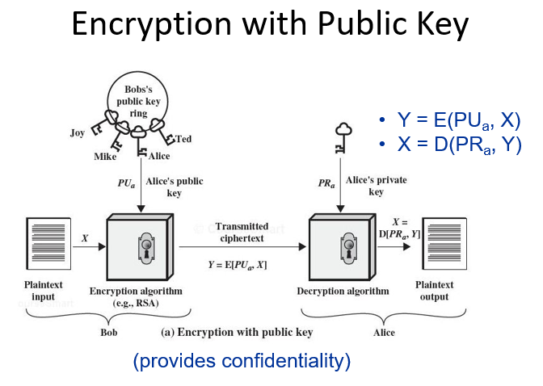
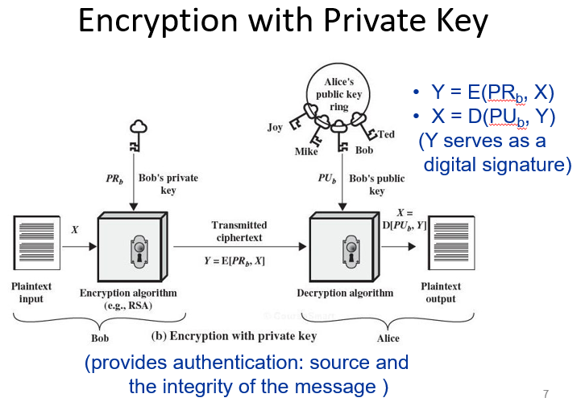
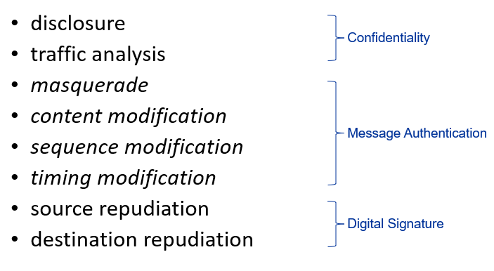

<!-- pandoc example.md -o example.pdf -->

## 2.1 Symmetric Encryption

### Model for Network Security

In consideration the place of encryption, we must use the following two models. The figure illustrated above models information being transferred from one party to another over an insecure communications channel, in the presence of possible opponents.

Security aspects come into play when its necessary or desirable to protect the information transmission from an attacker. All the techniques for providing security have two components:

- A security-related transformation on the information to be sent.
- Some secret information shared by the two parties which is hopefully unknown to the attacker.

They can use appropriate security transform (encryption) with suitable keys possibly negotiated using a trusted third party.

The second figure is concerned with controlled access to information/resources on a computer system in the presence of attackers. Here appropriate controls are needed on the access to and within the system to provide suitable security.

The SMs needed to cope with unwatned access fall into two broad categories as shown in the figure above:

- The first category is termed a gatekeeper function. It includes password-based login procedures that're designed to deny access to all but authorized users and/or screening logic that's designed to detect and reject worms, viruses, etc. 
- Once either an unwanted user/software gains access, the second line of defense consists of a variety of internal controls that monitor activity and analyze stored information to try and detect the presence of intruders.

### Basic Terminology and Notation

- Plaintext: The original message or data that's fed into the algorithm as input.
- Ciphertext: The scrambled message produced as output.
- Cipher: Algorithm for transforming plaintext to ciphertext.
- Key: Info used in the cipher known only to the sender and receiver.
- Encipher (encrypt): Scrambling process from plaintext to ciphertext.
- Decipher (decrypt): Process of transforming ciphertext back into plaintext.
- Cryptography: Study of encryption principles/methods.
- Cryptanalysis (codebreaking): Study of principles/methods of deciphering ciphertext without knowing key.
- Cryptology: Field of both cryptography and cryptanalysis.

### Cryptography

We can characterize cryptographic systems based on:

- Types of encryption operations used such as substitution, transposition, etc. Substitution referse to how each element in the plaintext(bit, letter, etc) are mapped to another element. Transposition refers to how elements in the plaintext are rearranged. We have to do the encryption in a way that no information is lost and is reversible while still being secure.
- Number of keys used such as single key, secret key, symmetric, two-key public, or asymmetric. If both senders and receivers use the same key, the system is symmetric. If the sender and receiver use different keys, the system is asymmetric.
- Way in which plaintext is processed such as block or stream. Block ciphers process a block of elements at a time. Stream ciphers process the elements of the plaintext continuously, one bit or byte at a time.

### Symmetric Cipher Model

As shown in the figure above, there are two requirements for secure use of conventional encryption:

- A strong encryption algorithm
- A secret key known only to the sender and receiver

For widespread use, the encryption algorithm is usually well known, but the secret key is not. The security of the system depends on the secrecy of the key, not the secrecy of the algorithm. Even if attackers see the encrypted message, without the key, they cannot decrypt it.

### Attacking Symmetric Encryption

There are two general approaches to attacking a symmetric encryption scheme:

- Cryptanalysis
  These kinds of attacks rely on the nature of the algoorithm plus some knowledge of plaintext characteristics. Attackers could also use sample plaintext-ciphertext pairs. The goal is to exploit the characteristics of the algorithm to deduce the specific plaintext or key.
  If the key is discovered, the attacker can decrypt all current and future messages encrypted with that key.
- Brute-force
  Brute force is trying every possible key on a piece of ciphertext until an intelligible translation into PT is obtained. On average, half of all possible keys must be tried to achieve success. The reason is as follows:
  Suppose a key has a length of $n$ bits. The total number of possible keys is $2^n$. It's likely to be the first key attackers try, or the last. In the average case, we would find the key halfway through because on average we'll have tried half of the possible keys efore we find the right one.

There are several cryptanalytic attacks:

- Ciphertext Only
  Only known algorithm and ciphertext are known. The goal is to find the plaintext or key.
- Known Plaintext
  We know some PT/CT pairs and the algorithm. The goal is to find the key.
- Chosen Plaintext
  We select a plaintext and learn its corresponding ciphertext. The goal is to find the key.
- Chosen Ciphertext
  We select a ciphertext and learn its corresponding plaintext. The goal is to find the key.
- Chosen Text
  We select some plaintext or ciphertext and learn its corresponding ciphertext or plaintext. The goal is to find the key.

### DES

DES was a block cipher that used 56-bit keys and 64-bit blocks. The algorithm was developed by IBM in the 1970s and was adopted by the NIST in 1977 as a federal standard. DES was based on LUCIFER, an earlier cipher by Horst Feistel. DES was the first publicly accessible cipher to be 'blessed' by a national agency such as the NSA.

It's a product cipher, so every block of bits it takes, it does a series of substitutions and transpositions using the key.

Since its adoption as a federalized standard, there have been lingering concerns about the level of security provided by DES in two areas: key size and the nature of the algorithm.

With a key length of 56 bits, there are $2^{56}$ keys. BF attacks appear impractical, but it was proven to be insecure. ADditionally, cryptanalytic attacks are possible using a variety of techniques like diferential and linear cryptanalysis. Differential cryptanalysis observes pairs of text blocks evolving along each around, while linear cryptanalysis is used to find linear approximations to the transformations. We could then observe the operation of a cipher under several related keys.

### AES

The AES cipher uses 128-bit blocks and keys from 128-256 bits. AES is an iterative cipher which operates on entire data blocks in every round rather than feistel which operates on half of the block at at time. It processes data as blocks of 4 columns of 4 bytes, so 128 bit block sizes.

All operations are performed on 8-bit bytes. The number of rounds is a function of the key length. The number of rounds is 10 for 128-bit keys, 12 for 192-bit keys, and 14 for 256-bit keys.

It's designed to be resistant against known attacks, also efficient and small, while being simplistic.

### Modes of Operation

Block ciphers form a basic building block which en/decrypts a fixed size block of data. To use these in practice, we usually need to handle arbitrary amounts of data, which may be available in advance and may only be available a bit/byte at a time. If block of data is available in advance, we can use a block cipher to encrypt each block. If the data is only available a bit/byte at a time, we use a stream mode.

To apply block ciphers in a variety of applications, five modes of operations have been defined by NIST. In essence, mode of operation is a technique for enhancing the effect of a cryptographic algorithm or adapting the algorithm for an application, such as applying a block cipher to a sequence of data blocks or a data stream.

However, recall that we'll often need to encrypt amounts of data; what if we use the same key? This creates a lot of security issues.

## 2.2 Asymmetric Encryption

The development of public-key cryptography is the greatest and perhaps the only true revolution in the entire history of cryptography. From its earliest beginnings to modern times, virtually all cryptographic systems have been based on the elementary tools of substitution and permutation, and can be classed as private/secret/single key systems. All classical and modern block and stream ciphers are of this form.

The main weakness of single-key systems is that its shared by both sender and receiver and if this key is disclosed, communications are compromised. Also since the key is symmetric, the parties are equal.

- It does not protect sender from receiver forging a message and claiming it's sent by sender.
- It does not protect receiver from sender denying sending a message.

### Public-Key Cryptography

Public-key cryptography is asymmetric involving the use of two separate keys. The two keys is uses is the public key and the private key. Anyone knowing the public key can encrypt messages or verify signatures, but cannot decrypt messages or create signatures.

Public key schemes are neither more or less secure than private key (security depends on key size); they will not totally replace private key schemes either since they are very slow. Both also have issues with key distribution, so they need a trusted third party or suitable protocol to protect them.

### Why Public-Key?

The concept of PK cryptography evolved from an attempt to attack two of the most difficult problems associated with symmetric encryption: key distribution and digital signatures. How do we securely distribute keys without having to trust a third party with it? How do we protect the two parties against each other?

### Encryption with Public Key

In the figure above, there are several parties. Everyone knows everyone else's public key.If Bob wants to send a message to Alice, he encrypts the message with Alice's public key. Alice then decrypts the message with her private key. This way, only Alice can decrypt the message.

Along with this, we can also encrypt with a private key. If Bob wants to send a message to Alice, he encrypts the message with his private key. Alice then decrypts the message with Bob's public key. This is called a digital signature. This shows that the message came from Bob and that it wasn't tampered with.

### Applications of Public-Key Algorithms

We can classify the applications of public-key algorithms into three categories:

- Encryption/decryption (confidentiality)
- Digital signatures (authentication)
- Key exchange

Some algorithms are suitable for all uses, while others are suitable for only one or two. The RSA algorithm is suitable for all three while Diffie-Hellman is only suitable for key exchange.

### Public Key Cryptanalysis

Recall that public key schemes are not more or less secure than private key schemes since the size of the key determines the security. Like private key schemes, public key schemes are vulnerable to brute-force attacks. The countermeasure is the same: use bigger keys. However, there's a tradeoff to be considered. Public-key systems depend on use of some sort of invertible mathematical function. The complexity of calculating these functions does not scale linearly with the number of bits in the key. Thus, the key size must be large enough to make BF attacks impractical but small enough for practical encryption/decryption.

In practice, the key sizes that've been proposed do make BF attacks impractical but result in encryption/decryption speeds that are too slow for general-purpose use. Instead, public-key encryption is currently confied to key management and signature applications. Another form of attack is to find some way to compute the private key given the public key. To date, it's not been mathemetically proven that this form of attack is infeasible for a given public-key algorithm.

### RSA

RSA is the most well known and used general public key encryption algorithm. It's based on the exponentiation in a finite (Galois) field over integers module a prime, using large integers(1024 bits). It's security is due to the cost of factoring large numbers.

It's a block cipher, the PT And CT are integers between 0 and $n-1$ for some $N$. The typical size of $n$ is 1024 bits.

### RSA Encryption and Decryption

To encrypt the message $M$, the sender optains the public key of the recipient and computes the ciphertext blah blah blah. The owner would then decrypt the message by using their private key and blah blah blah.

### Random Numbers

Random numberes play an important role in the use of encryption for various network security applications. Getting good random numbers is important, but difficult. They have many uses in cryptography, including:

- Nonces in authentication protocols to prevent replay attacks
- Session key generation
- Key generation for public-key algorithms
- Keystream for symmetric stream encryption

Two distinct and not neceessarily compatible requirements for a sequence of random numbers is:

- Randomness: the sequence of numbers must be statistically random, meaning that each number is statistically independent of the others.
- Unpredictability: the sequence of numbers must be unpredictable, meaning that it's infeasible to predict future numbers in the sequence based on past numbers.

### Pseudorandom vs. True Random

Cryptographic applications typically make use of algorithmic techniques for RNG. These algorithms are deterministic and therefore produce sequence of numbers that are not statistically random. However, if the algorithm is good, the resulting sequence will pass many reasonable tests of randomness. Such numbers are referred to as pseudorandom numbers. What we need to truly protect is the seed against attackers.

TRNGs use a nondeterministic source to produce randomness. Most operate by measuring unpredictable natural events and converting them to digital form; some examples include pulse detectors of ionizing radiation events, gas discharge tubes, and leaky capacitors. We could also try reading the time between keystrokes, mouse movements, etc. They're more expensive and slower than PRNGs.

### Cryptographic Hash Functions

Hash functions accept a variable-legnth block of data $M$ as input and produce a fixed-size hash value $h = H(M)$. Good hash functions have the property that the results of applying the function to a larger set of inputs will produce outputs that are evenly distributed and apparently random.

In general terms, the principal object of a hash function is data integrity. A change to any bit or bits in $M$ will result in a change to the hash code. The kind of hash function needed for security applications is referred to as a cryptographic hash function.

CHFs are algorithms for which it is computationally infeasible to find a (a) data object that maps to a pre-specified hash result and (b) two data objects that map to the same hash result. I.e., they can't be reversed and they're collision resistant.

In terms of security, they can be used on messages to provide a fingerprint of the message. If the message is changed, the hash value will change. They can also be used to provide a fingerprint of a public key. This is called a digital certificate.

There are many other uses for hash functions including:

- Create a one-way password file. We can store hashes of passwords and not the actual passwords.
- For intrusion detection and virus detection. We can store hashes of known viruses and compare them to the hashes of files on the system. Along with this, we can also store hashes of known good files and compare them to the hashes of files on the system.
- Pseudo-random number generation. We can use the hash of a seed value to generate a sequence of pseudo-random numbers.

### Hash Function Requirements

Hash functions are used to produce a fingerprint of a file, message, or other blocks of data. To be useful more authentication, hash functions must have the the following properties:

- One way property
  Computationally infeasible to find $x$ such that $H(x) = h$. It must be easy to generate a hash given a message, but hard to generate a message given a hash.
- Weak collision resistance
  Computationally infeasible to find $y \neq x$ such that $H(x) = H(y)$. It should be impossible to find an alternative message with the same hash value as the given message. This prevents forgery when an encrypted hash code is used.
- Strong collision resistance
  Computationally infeasible to find any pair $x, y$ such that $H(x) = H(y)$.

### Message Security Requirements

In the context of communications across a network, the attacks listed above can be identified, with more detail given in the book.

Disclosure is the release of message contents and traffic analysis is the discovery of the pattern of traffic between parties; this belongs in the realm of message confidentiality and are handled using encryption techniques.

Masqureade is the insertion of messages into the network from a fraudulent source, content modification is obvious, sequence modification is the insertion, deletion, or reordering of messages, and timing modification is the delaying or replaying of messages. These belong in the realm of message authentication. Source repudiation and destination repudiation are handled using digital signatures.

Message authentication is concerned with protecting the integrity of a message and validating the identity of the originator. Message authentication and digital signatures both use some lower-level function to generate an authenticator. There are three classes of low-level functions that can be used:

- Hash functions
- Message encryption
- Message authentication codes (MAC)

MACs are smalled fixed-size blocks of data. They're generated from the message + secret key and are appended to messages when sent. They're then automatically compared at the destination to verify the integrity of the message and provide authentication of the sender.

While message authentication protects two parties who exchange messages from third parties, it does not protect two parties against each other either fraudulently creating or denying messages. Dignital signatures are analogous to handwritten signatures and provide a set of security capabilties that'll be difficult to implement in any other way. It must have the following properties

- Verifies the author + date/time of signature
- Authenticate the contents at the time of signing
- Verifiable by third parties to resolve disputes

### Key Management and Distribution

There are several ways keys are managed and distributed:

- Symmetric Key Distribution using symmetric encryption
- Symmetric Key Distribution using asymmetric encryption
- Distribution of public keys using a public-key authority, certificate, or X.509 certificates
- PKI public-key infrastructure

For end-to-end encryption, some variation on option 4 has been widely adopted. In this scheme, a key KDC is responsible for distributing keys to pairs of users(hosts, processes, applications) as needed. Each user must share a unique key with the the KDC for purposes of key distribution. The use of a KDC is based on a hierarchy of keys. At a minimum, two levels of keys are used: a session key, used for the duration of a logical connection and a master key shared by the KDC and an end system or user and used to encrypt the session key.

I.e., session keys are temporary; they're used for encryption of data between users and discarded after. Master keys are used to encrypt session keys and are shared between users and the KDC. These are distributed using public key cryptography.

### Public Key Certificates

These certificates allow key exchange without real-time access to a public-key authority. These certificates bind identity to public key with all contents signed by a trusted Public-Key or certificate authority. Users can present their public key to the authority in a secure manner to obtain a certificate.

The user can then publish the certificate. Anyone needing this user's public key can obtain the certificate and verify that it's valid by way of the attached trusted signature. Participants can also convey its key information to another by transmitting its certificate.