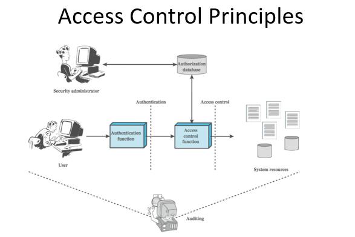
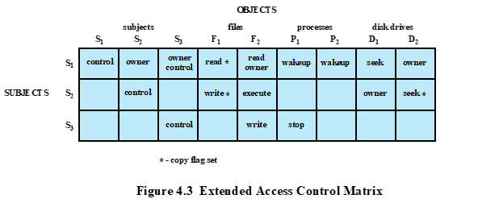
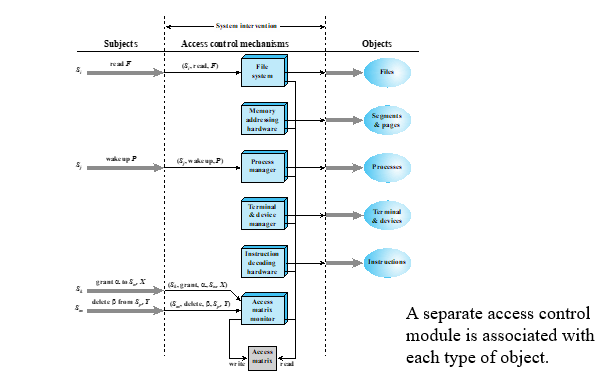
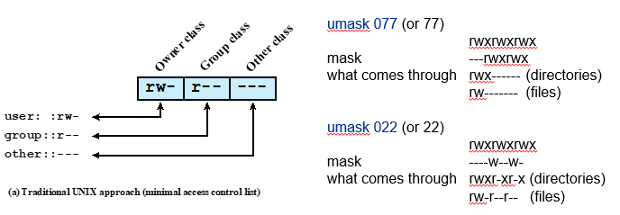
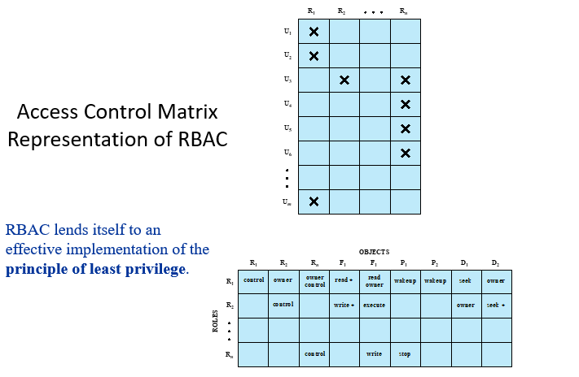
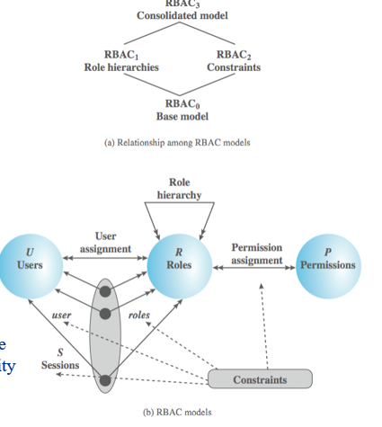

<!-- pandoc example.md -o example.pdf -->

## Slides

### Access Control

Access control is the prevention of unauthorized use of a resource, including the prevention of use of a resource in an unauthorized manner. IT's a central element of computer security.

The principal objective of computer security as we know is to prevent unauthorized users from gaining access to resources, to prevent legitimate users from accessing resources in an unauthorized manner, and to enable legitimate users to access resources in an authorized manner.

I.e., AC is concerned with determining the allowed activities of legitimate users, mediating every attempt by a user to access a resource in the system. It's concerned with how authorizations are structured.

Ac considers the situation of a population of users and user groups that are able to authenticate to a system and are then assigned access rights to certain resources within the system.

### AC Principles

This chapter deals with a narrower, more specific concept of AC which implements a security policy that specifies who or what may have access to each specific system resource and the type of access that is permitted in each instance.

The figure above shows a broader context of AC. In addition to AC, this broader context involves the following entities and functions:

- Authentication: The verification of an identity claimed by or for a system entity.
- Authorization: The granting of a right or permission to a system entity to access a system resource. This function determines who is trusted for a given purpose.
- Audit: An independent review and examination of system records/activities to test for adequancy of system controls; to ensure compliance with established policy and operational procedures, to detect breaches in security, and to recommend any indicated changes in control, policy, and procedures.

### AC Elements

There are three basic elements of AC:

- Subject
  An entity capable of accessing objects. Users/applications gain access toobjects by means of a process that represent that user or application. The process takes on the attributes of the user, such as access rights and permissions, and is then able to access objects on behalf of the user.
  Basic AC systems define three classes of subjects, with different AC for each class.

    - Owner: The creator of the resource, such as a file. For system resources, ownership may belong to a sys admin.
    - Group: Named group of users may also be granted AC, such that membership in a group is sufficient to exercise these AC. In most schemes, users can belong to more than one group.
    - World: The least amount of access is granted to users who are able to access the system but are not included in the owner or group for this resource. Basically, everyone else.

- Object
  Objects are resources to which access is controlled. In general, objects are entities used to contain and/or receive information. This includes records, blocks, pages, segments, files, etc.
  The number and type of objects protected in a AC system depend on the nevironment in which the AC operates and the desired tradeoff between security on one hand, and complexity, processing burden, and ease of use on the other hand.
- Access Rights
  Access rights describe the way in which subjects may access an object. THey include read, write, and execute.
  Read means that uesrs may view the information in a system resource. It includes the ability to copy or print.
  Write means that they may add, modify, or delete data in system resources. Write includes read.
  Execute means that they may run the resource as a program. Execute includes read and write.

### AC Policies

Access control policies, which can be embodied in an authorization database, dictates what types of access are permitted, under what circumstances, and by whom. There are four major categories:

- Discretionary Access Control (DAC)
  Controls access based on the identity of the requestor and on access rules stating what requestors are allowed to do. This policy is termed discretionary because an entity might have access rights that permit the entity, by its own volition, to enable another entity to access some resource.

- Mandatory Access Control (MAC)
  Controls access based on comparing security labels with security clearances. Security labels indicate how sensitive or critical system resources are. Security clearances indicate which system entities are eligible to access certain resources.
  It's termed mandatory because an entity that has clearance to access a resource may not, just by its own volition, enable another entity to access that resource.

- Role-Based Access Control (RBAC)
  Controls access based on the roles that users have within the system and on rules stating what accesses are allowed to users in given roles. This policy is termed role-based because control is based on the roles that users have in the system.

- Attribute-Based Access Control (ABAC)
  Controls access based on attributes of the user, the resource to be accessed, and current environmental conditions. This policy is termed attribute-based because access is based on attributes assigned to subjects, objects, and the environment.

DAC is the traditional method of implementing access control. MAC is a concept that evolved out of requirements for military information security. RBAC and ABAC are becoming more popular. They're not mutually exlusive. An AC mechanism can employ two or even all three of these policies to cover different classes of resources.

### Access Control Requirements

These are features that must be upheld by the AC system:

- Reliable Input: It assumes that a user is authentic, thus an authentication mechanism is needed as a front end to an AC system. Other inputs to the AC must also be reliable.
- Support for fine and coarse specifications: fine-grained specifications allow access regulated at the level of individual fields/records in files; each individual access by a user rather than a sequence of accesses. Sys admins should also be able to choose coarse-grain specification for some class of resource access.
- Least Privilege: A user should be given no more privilege than necessary to perform a given function. This is a basic principle of computer security.
- Separation of Duty: Should divide steps in a system function among different individuals, so as to keep a single individual from subverting the system. E.g., a sys admin should not be able to create a user and also assign that user a password.
- Open and closed policies: A closed policy only allows accesses that are specifically authorized: open policy allows all access except for what is specifically excluded.
- Policy Combinations and Conflict Resolution: may apply multiple policies to a given class of resources, and need a procedure to resolve conflicts between policies.
- Admin Policies: Specify who can add, delete, or modify authorization rules, and also need AC and other control mechanisms to enforce these policies.

### Discretionary Access Control (DAC)

This is based on the identity of the requestor and on AC rules. In this scheme, an entity may be granted AC rights that permit the entity by its own discretion to enable another entity access some resource.

DACs often use access matrices, which list subjects in dimension (rows), and list objects in the other dimension (columns). Each entry in the matrix indicates the access rights that the subject has for the object.

These matrices are often sparse, but they're powerful because we can decompose by either row or column. By column, we get access control lists which list what users have access to a given object. By row, we get capability lists which list what objects a given user has access to.

Exapnding on ACLs, the ACL lists users and their permitted access rights. The ACL may contain a default, or public, entry. This allows users not explicitly listed as having default rights. Elements of the list may included individual users as well as groups of users. When it's desired to dermine which subjects have which access rights to a particular resource, ACLs are convenient because each ACL provides the information for a given resource.

For capability tickets, these tickets specify authorized objects and operations for a user. Each user has a number of tickets and may be authorized to loan or give to others. Since tickets may be dispersed around a system, they present a greater security problem than ACLs. In particular, the ticket must be unforgeable. One way to accomplish this is to have OS hold all tickets on behalf of the user. It'll be held in a region of memory inaccessible to users. The convenient and inconvenient aspects of capability tickets are the opposite of those for ACLs.

### General Model for DAC

This model assumes a set of subjects, a set of objects, and a set of rules that govern the access of subjects to objects.

The protection state of a system is the set of information, at a given point in time, that specifies that access rights for each subject with respect to each object. Each entry within the model $A[S,X]$ specifies the access rights of subject S to object X.

A request to modify the AC matrix is treated as an access to the matrix, with the individual entries in the matrix treated as objects.

### Organization of the AC Function

From a logical pov, a separate AC module is associated with each type of object as shown in the following figure.

The module evaluates each request by a subject to an object to dermine if the access right exists. Access attempts trigger the following steps:

1. A subject $S_0$ issues a request of type $\alpha$ for object $X$.
2. The request causes the system (OS or AC interface module) to generate a messageo f the form $(S_0, \alpha, X)$ to the controller for $X$.
3. The controller interrogates the access matrix $A$ to determine $\alpha$ is in $A[S_0, X]$. If so, access is allowed. For example, if $S_0$ wants to write to $X$, the controller checks if $W$ is in $A[S_0, X]$. However, if $S_0$ can only read, then access is denied.

### Protection Domain

The AC matrix model that we've discussed associates a set of capabilities with a user. A more general and flexible approach proposed is to associate capabilities with protection domains. A protection domain is a set of objects together with access rights to those objects. In terms of the access matrix, a row defines a protection domain. Previously, each row equated to a specific user. In this limited model, each user has a protection domain, and any processes spawned by the user have access rights defined by the same protection domain.

For example, users can spawn processes with a subset of of the access rights fo the user, defined as a new protection domain. It limits the capability of the process. Such a scheme could be used by a server process to spawn processes for different classes of users.

### UNIX/Linux File Concepts

All types of UNIX files are administered by the OS by means of inodes. Inodes stand for index node, and are a control structure that contains the key information needed by the OS For a particular file. Several file names may be associated with a single inode, but an active inode is associated with exactly one file, and each file is controlled by exactly one inode. The attributes of the file as well as its permissions and other control information are stored in the inode.

The attributes of the file as well as its permissions and other control information are stored in the inode. On the disk, there's an inode table or list that contains the inodes of all the files in the file system. When a file is opened, its inode is brought into main memory and stored in a memory-resident inode table.

Directories are structured in a hierarchical tree. Each directory can contain files and other directories. A directory that's contained in another directory is called a subdirectory. The directory that contains the subdirectory is called the parent directory. The directory at the top of the tree is called the root directory. The root directory is the only directory that's not contained in another directory.

### UNIX/Linux File AC

Associated with each file is a set of 12 protection bits.

Each UNIX user is assigned a unique user ID. A user is also a member of a primary group, and possibly a number of other groups, each identified by a group ID. When files are created, it's designated as owned by a particular user and marked with that user's ID. It also belongs to a specific group, which initially is either it's rceator's primary group, or the group of its parent directory if that directory has a setGID permission set.

Within the protection bits, the owner ID, group ID, and protection bits are part of the file's inode. 9 of the the protection bits specify read, write, and execute permissions for the owner of the file, other members of the group to which this file belongs, and all other users.

These form a hierarchy of owner, group, and all others, with the highest relevant set of permissions being used. The three remaining bits define special additional behavior for files and directories. Two of these are the set user ID and set group ID permissions. The final bit is the sticky bit.

If the set user ID and set group ID are set on an executable file, the OS functions as follows:

1. When a user with execute privileges executes this file, the system temporarily allocates the rights of the user's ID of the file creator, or the file's group, respectively, to those of the user executing the file. These are known as the effective user Id and effective group Id and are used in addition to the real user ID and real group ID of the executing user when making AC decisions for the program.

This feature enables the creation and use of privileged programs that may use files normally inaccessible to other users. It enables users to access certain files in a controlled fashion.

### RBAC

RBAC is based on the roles that the user assumes in a system rather than the user's identity. One layer of indirection, but it's a powerful concept. It's a way of implementing the principle of least privilege.

RBAC models define a role as a job function within an organization. They typically assign AC rights to roles instead of individual users. In turn, users are assigned to different roles, either statically or dynamically, according to their responsibility.

RBAC models typically user two access matrices. The first matrix assigns users to roles. The second matrix assigns permissions to roles. The user-role matrix is typically sparse, since most users are not assigned to many roles. The role-permission matrix is typically dense, since most roles have many permissions.

A variety of functions and services can be included under the general RBAC approach. There are a family of reference models, that consists of four models that are related to each other as shown here:

$RBAC_0$ is the core model and contains the minimum functionality for an RBAC system. $RBAC_1$ includes the $RBAC_1$ functionality and adds role hierarchies which enable one role to inherit permissions from another role. $RBAC_2$ includes $RBAC_0$ and adds constraints, which resicts the way in which the components of a RBAC system may be configurated; these include rules like a user can only be part of one role, or how any permission can be granted to one one role. $RBAC_3$ includes $RBAC_0$ plus $RBAC_1$ and $RBAC_2$.

$RBAC_0$ systems contain four types of entities:

- User: An individual that has access to the system, and has a user ID.
- Role: A named job function within the organization that controls this system. Typically, associated with each role is a description of the authority and responsibility conferred to this role, and on any users within this role.
- Permission: Approval of a particual mode of access to one or more objects. Equivalent terms are access right, privilege, and authorization.
- Session: A maaping between a user and an activated subset of the set of roles to which the user is assigned.

### Summary

- Access control is the prevention of unauthorized use of a resource, including the prevention of use of a resource in an unauthorized manner.
- DAC
  Pros: Simple, flexible, and easy to implement. Users have control over their resources and can grant permissions to others.
  Cons: Since users control access to their own resources, there's a risk of inapporpriate permissions being granted, either accidentally or maliciously.
  There's also no central control which leads to inconsistencies and difficulties in administration.

- MAC
  Offers a higher level of security by enforcing strict access policies defined by a central authority. Objects have security labels that indicate their sensitivity. Subjects have security clearances that indicate their authorization to access objects. Access is granted or denied based on the comparison of the security label of the object and the security clearance of the subject.
  Cons: Difficult to implement and administer. It's also inflexible and difficult to adapt to changing needs.

- RBAC
  Pros: Offers a higher level of security by enforcing strict access policies defined by a central authority. Access rights are assigned to groups of users based on their role in the organization. Users are assigned to roles based on their job function. This simplifies administration and ensures that users have only the access they need to do their jobs.
  Cons: Difficult to implement and administer. Large number of roles can be difficult to manage. Also may not be flexible enough to adapt to changing needs.

- ABAC
  Pros: Offers a higher level of security by enforcing strict access policies defined by a central authority. Access rights are assigned to users based on attributes of the user, the resource to be accessed, and current environmental conditions. This simplifies administration and ensures that users have only the access they need to do their jobs.
  Cons: Difficult to implement and administer. Large number of attributes can be difficult to manage. Also may not be flexible enough to adapt to changing needs.

## 50 ways to Leak your Data: An exploration of app's circumvention of the Android permissions system

In theory, if users deny permissions for certain resources to apps, the app is restricted. However it's not that simple.

There are two main ways apps circumvent the permission system:

- Covert Channel: An app that has permission shares data with apps that don't have permission.
- Side Channel: There's an intentional or unintentional gap that allows data to be leaked.
