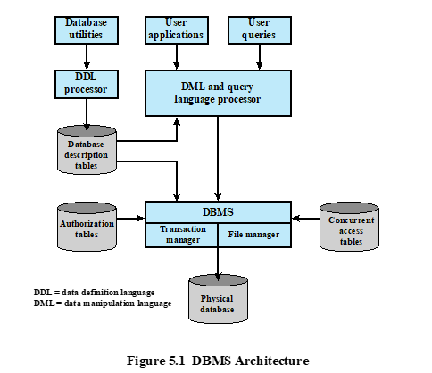
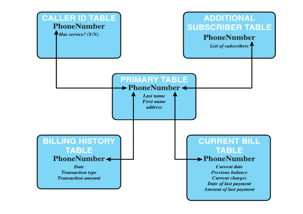
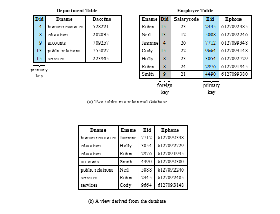
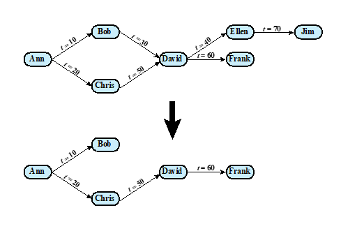
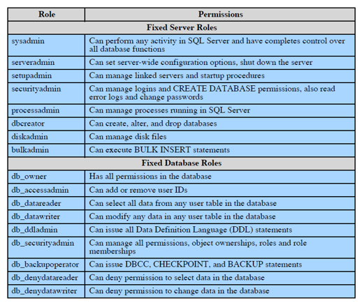
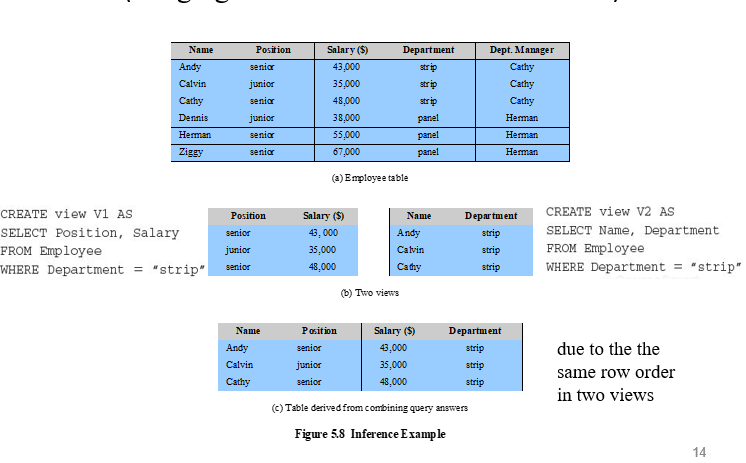
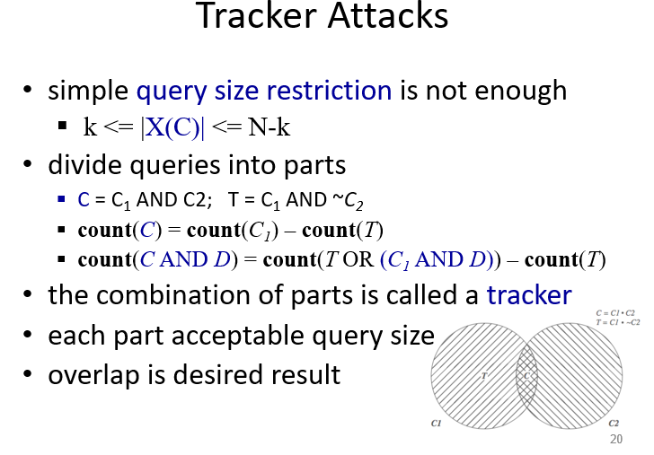
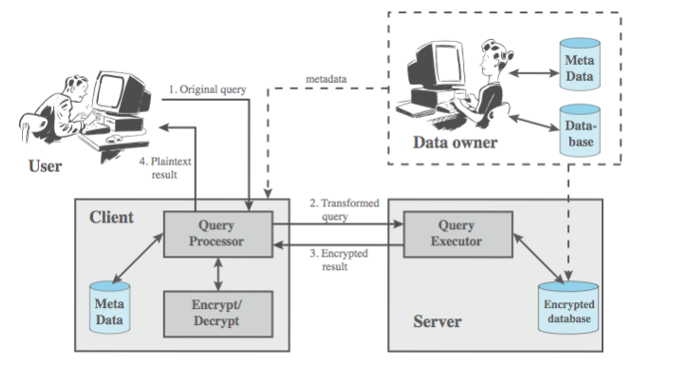
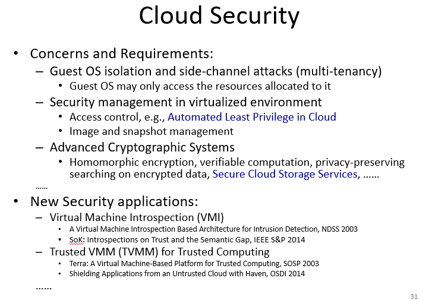

<!-- pandoc example.md -o example.pdf -->

## Slides

The basic building block of a relational database ia table of data similar to a spread sheet. Each column holds a particular type of data, while each row contains a specific value for each column. Ideally, the table has at least one column in which each value is unique, thus serving as an identifier for a given entry.

The relational database structure enables the creation of multiple tables tied together by a unique identifier that's present in all tables. The database admin can define a new table with a column for the primary key and the other columns for other information.

Users and applications user a relational query language to access the database. The query language uses declarative statements, rather than the procedural instructions of a programming language.

In essence, the query language allows the user to request selected items of data from all records that fit a given set of criteria. The software then figures how to extract the requested data from one or more tables.

### RDBMS Architecture

DB designers and admins make use of a data definition language (DDL) to define the db logical structure and procedural properties, which are repesented by a set of db description tables.

A data manipulation language (DML) provides a powerful set of commands for adding, deleting, and modifying data in the database. Query languages are declarative languages designed to support end users.

The DB management system amkes use of the db description tables to manage the physical database. The interface to the db is through a file manager module a transaction manager module.

In addition to the db description table, two other tables support the DBMS. The DBMS uses authorization tables to ensure the user has permission to execute the query language statement on the DB. The concurrent access table prevent conflicts when simultaneous conflicting operations are executed on the DB.

DB systems provide efficient access to large volumes o data and are vital to the operation of many organizations. Due to their complexity and criticality, DB systems generate security requirements that're beyond the capability of typical OS based security mechanisms.

OS security mechanisms typically control read and write access to entire files. While they can be used to allow users to read/write any information in, they cannot be used to limit access to specific records or fields in that file. A DBMS typically does allow this type of more detailed access control to be specified.

### Relational DB Example

The figure above shows how new services and features can be added to the telephone database without reconstructing the main table. In the example, ther's a primary table with basic information for each phone number. The phone number serves as the primary key. The DB admin can then define a new table with a column for the primary key, and other columns for other information.

### Relational DB Elements

In this example, we have a department table. The department ID (DID) is the primary key; notice how each value is unique. The table gives the ID, name, and account number for each department. THe employee table contains the name, salary code, employee ID, and phone number of employee. It also indicates the department to which employee is assigned. In the employee table, the DID is identified as a foreign key and provides the relationship between employee table and department table.

### Structured Query Language (SQL)

SQL is a standardized language that's used to define, manipulate, and query the data in a relational database.

There are several versions and variety of implementations but all follow the same basic syntax and semantics. For example, SELECT is used to retrieve data from the database, INSERT is used to add new data to the database, and UPDATE is used to modify existing data.

### Database Access Control

Commercial and open-source DBMSs  typically provide an AC capability for the db. The DBMS operates on the assumption that the system has authenticated each user already.

As an additional line of defense, the system may use the overall AC system to determine whether a user has access to the DB as a whole or just portions of it. For users who are authenticated and granted access to the DB, a DB AC system provides a specific capability that controls access to portions of the DB. This includes whether a user can read, write, insert, delete, or update the entire DB or just portions of it.

Commercial and open-source DBMSs provide discretionary or role-based AC. Typically, DBMS can support a range of administrative policies including:

- Centralized Administration: A small number of privileged users may grant and revoke access rights.
- Ownership-based Administration: The owner of a table or view may grant and revoke access rights to that table or view.
- Decentralized Administration: In addition to granting and revoking access rights to a table, table owners may grant and revoke authorization rights to other users, allowing them to grant and revoke access rights to the table. I.e., the owner of a table is able to delegate the authority to grant and revoke access rights to other users.

As with any AC system, a DB AC system distinguishes different access rights, including create, insert, delete, update, read, and write. Some DBMSs provide considerable control over the granularity of access rights.

Access rights can be to the entire db, or selected rows or columns within a table. Access rights can also be determined based on the contents of a table entry. For example, in a personnel db, some users may be limited to seeing salary information only up to a certain maximum value. Department managers may only be allowed to view salary information for employees in their department.

### SQL Access Control Statements

- GRANT and REVOKE Statements: These statements are used to grant and revoke privileges to users and roles.
  GRANT SELECT ON TABLE t TO maria, harry
- SELECT, INSERT, UPDATE, DELETE, ETC: These statements modify the contents of the database.

The grant option enables an access right to cascade through a number of users. WE consider a specific access right and illustrate the cascade phenomenon below:

In the figure, Ann grants the access right to Bob at $t=10$ and to Chris at $t=20$. Thus, Bob is able to grant the access right to David at $t=30$.

Just as the granting of privileges cascades from one user to another using the grant option, the revocation of privileges also cascades. Thus, if Ann revokes the access right to Bob and Chris, then the access right is also revoked for all userse to whom Bob and Chris have granted the access right.

A complication arises when a user receives the same access right multiple times. For example, Ann grants the access right to Bob at $t=10$ and again at $t=20$. If Ann revokes the access right at $t=30$, then the access right is revoked for Bob at $t=10$ but not at $t=20$.

### RBAC

RBAC schemes are a natural fit for DB access control. Unlike a file system assocaited with a single or few applications, a DB system often supports dozens of applications. In such an environment, indvidiual users may use a variety of applications to perform a variety of tasks, each of which require its own set of privileges.

RBAC provides a means of easing administrative burden and improving security. There are three main categories of DB users:

- Application Owner: an end user that owns DB objects (tables, columns, rows) as part of an application. The application owner may assign roles to end users.
- End users other than the application owner: An end user that operates on DB objects via a particular application but does not own any of the DB objects.
- Admins: Users who have admin responsibility for all parts of the DB. Admins are reponsible for more sensitive or general roles, including those having to do with managing physical and logical DB components, succh as dat afiles, users, and security mechanisms. The system needs to be set up to give certain admins certain rpivileges.

DB RBAC facility needs to be able to create and delete roles, define permissions for a role, assign and cancel assignments of users to roles.

A good example of use of roles in DB security is the RBAC facility provided by Microsoft SQL Server.

The first two types of roles are referred to as fixed roles. These are preconfigured for a system with specific access rights. The admin or user cannot add, delete, or modify fixed roles; it's only possible to add/remove users as members of fixed roles.

Fixed server roles are defined at the server level and exist independently of any user db. They are designed to ease admin task. These roles have different permissions and are intended to provide the ability to spread the admin responsibilities without having to give out complete control. DB admins can use these fixed server roles to assign different admin tasks to personnel and give them only the rights they absolutely need to perform their tasks.

Fixed DB roles operate at the level of an individual DB. As with fixed server roles, some of the fixed DB roles are designed to assist a DB admin with delegating administrative responsibilities.

### Inference Attack

These attacks refer to the process of performing authorized queries and deducing unauthorized information from the legitimate responses received. It happens when a combination of data items are more sensitive than the individual items or can be used to infer data of a high sensitivity.

In essence, attackers may make use of nonsensitive data as well as metadata. Metadata refers to knowledge about correlations or dependencies amongst data items which can then be used to deduce information not otherwise available.

There are two general inference techniques:

- Analyzing functional dependencies between attributes within a table.
  Employee-salary table has three attributes; NAME, RANK, and salary
  The constraint that all employees having indetical ranks have the same salary is known: RANK->SALARY.

- Merging views with the same constraints.

The figure above shows a clearer example of what an inference attack is. Users of these views are not authorized to access the relationship between name and salary. Users who has access to either or both views cannot infer the relationship by functional dependicies. That is, there is not a functional relationship between Name and Salary such that knowing Name and perhaps other information is sufficient to deduce Salary.

However, suppose the two views are created with the access constraint that Name and Salary cannot be accessed together. A user who knows the structure of the employee table and who knows that the view tables maintain the same row order as the employee table is then able to merge the two views to construct the bottom most view. This violates the access control policy that the relationship of attributes Name and Salary must not be revealed.

The attacker guesses that Andy, Calvin and Cathy, based on clues in real life that they're seniors, juiniors, and seniors, respectively will paste the other table together to guess their salaries.

### Inference Attack Countermeasures

There are two approaches to dealing with the threat of disclosure by inference:

- Inference detection during DB design: removes an inference channel by altering the DB structure or by changing the AC regime to prevent inference. This includes removing data dependecies by splitting a table into multiple tables or using more fine-grained AC roles in an RBAC scheme.
- Inference Detection at query time: elimnate an inference channel violation during a query or series of queries. If inference channel detect, query is denied or altered.

For either cases, some inference detection algorithm is needed. This is complicated and difficult.

### Statistical DB

Statistical DBs (SDB) is one that provides data of a statistical nature, such as counts and averages. SDBs are used in two contexts:

- Pure statistical DBs: This type of DB only stores statistical data. An example is a census DB. Typically, access control for a pure SDB is straightforward: certain users are authorized to access the entire DB.
- Ordinary DB with statistical access: This type of DB contains individual entries; thisi s the type of DB discussed so far. The DB supports a population of nonstatistical users who're allowed to access selected portions of the DB using DAC, RBAC, or MAC. In addition, the DB supports a set of statistical users who are only permitted statistical queries; they cannot access individual records. For the latter users, aggregate statistics based on the underly raw data are generate in response to a user query, or may be pre-calculated and stored as part of the DB.

The AC objective for an SDB is to provide users with the aggregate information without compromising the confidentiality of any individual entity represented in the DB. The security problem is one of inference. The DB admin must prevent or at least detect the statistical user who attempts to gain individual information through one or more statistical queries.

I.e., statistical users may infer confidential information about individual enties represented in the SDB; such an inference is called a compromise.

### Protection against Inference

There are two distinct approaches to protect a SDB from inference attacks:

- Query restriction: The DB admin may restrict the queries that lead to a compromise. Answers provided are accuate, but the DB admin must ensure that the queries are not too revealing. This is the most common approach. The simplest form of query restriction is query size resitrction.
- Perturbation: In this approach, it provides answers to all queries, but the asnwers are approximate due to the addition of noise to the statistic generated from the original data. This can be done in one of two ways: the data in the SDB can be modified (perturbed) so as to produce statistics that cannot be used to infer values for individual records. Alternatively, when a statistical query is made, the system can generate statistics that are modified from the true statistics.

Regardless designer must attempt to produce staitstics that accurately reflect the underlying db. The main trade-off is between security and accuracy.

### Tracker Attacks

Although query size restriction can prevent trivial attacks, it's more vulnerable to sophisticated attacks, such as the use of a tracker. Here the questioner divides his knowledge of an individual into parts, such that queries can be made based on the parts without violating any query size restrictions.

The combination of parts is called a tracker, because it can be used to track down characteristics of an individual.

### Other Query Restriction Approaches

A number of other query restrictions have been studied, all of which have their own advantages and disadvantages. However, using them in combination does reduce vulnerability.

### DB Encryption

DBs are a valuable source of information and is protected by multiple layers of security: firewalls, authentication: OS access control systems, DB access control systems, and DB encryption.

Encryption can be applied to the entire DB, at the record level(encrypt selected records), at the attribute level(encrypt selected columns), or at the level of the individual field.

One approach is to encrypt the entire DB and not provide the encryption/decryption keys to the service provider. This is inflexible. The user has little ability to access individual data items based on searches or idnexing on key parameters, but rather would have to download entire tables from the database, decrypt the tables, and work with th eresults.

To provide more flexibility, it muist be possible to work with the DB in its encrypted form. The simplest possible arrangement is that each individual item in the DB is encrypted separately using the same encryption key. Thus, the encrypted db is stored at the server, but the server does not have the key so that data is secure at the server. The client system must have acopy of the key so they can encrypt fields to check in the query and decrypt fields in the results.

This method is easy but lacks flexibility. The set of encrypted values do not preserve the ordering values in the original attribute. To provide more flexibility, each record(row) of a table in  a DB is encrypted as a block. To assist in data retrieval, attribute indexes are associated with each table. For some or all of the attributes an index value is created. THis arrangement provides for mroe efficient data retrieval, but leaks rough ordering info to any attacker.

A db encryption example is listed below in the figure.

- Data Owner: Organization that produces sensitive data.
- User: Someone or something that presents requests(queries) to the DB.
- Client: Front-end that transforms user queries into queries on encrypted data.
- Server: Thing that receives encrypted data from a data owner and makes them available for distribution to clients. The server could be owned by the data owner but more typically is owned and maintained by an external party.

Suppose that each individual item in the db is encrypted separately using the same key. THe encrypted DB is stored at the server, but the server doesn't have the key so the data is secure at the server. The client system does have a copy of the encryption key. A user at the client can retrieve a record from the DB with the following steps:

1. User issues a SQL query for fields from one or more records swith a specific value of the primary key.
2. The query processor at the client encrypts the primary key, modifies the SQL query accordinly, and transmits the query to the server.
3. The server processes the query using the encrypted value of the primary key and returns the encrypted record.
4. The query processor decrypts the data and presents it to the user.

### Virtualization, VM, and VMM

Each VM is given the illusion of being a dedicated physical machine that's fully protected and isolated from other VMs. VMM are a thin layer of software that virtualizes hardware resources, exporting a virtual hardware interface that reflects the underlying machine architecture.

### Cloud Security

