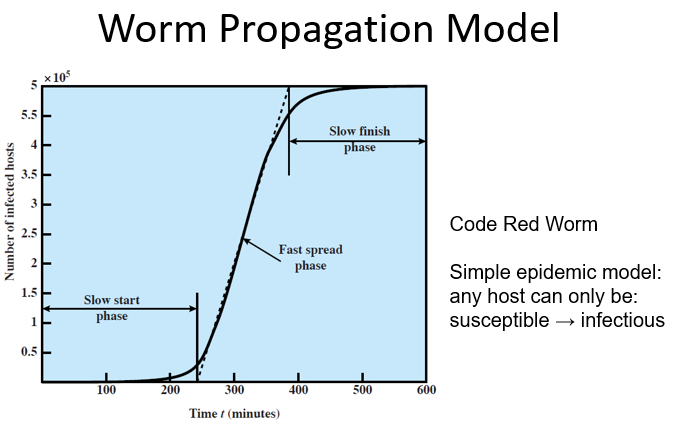
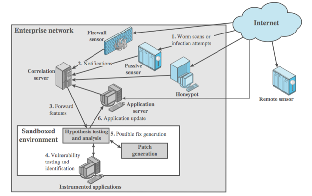

<!-- pandoc example.md -o example.pdf -->

## Slides

### Malicious Software (Malware)

Programs that exploit vulnerabilities in a system are referred as malware. In this context, we're concerned with application programs as well as ultility programs such as editors, compilers, and kernel-level programs.

Malware can be divided into two categories: those that need a host program, and those that don't.

The former are essentially fragments of programs that cannot exist independently of some actualy application program, utility, or system program. Viruses logic bombs, and backdoors are examples. They're usually self-replicating or activated by a trigger. THe action/payloads occur once a target is reached.

The latter are self-contained programs that can be scheduled and run by the OS. Worms and bot programs are examples.

We also differentiate between malware that replicate and those that don't. The former consists of either a program fragment or an independent program that, when executed, mayp produce more copies of itself to be activated later on the same system or other system. Viruses and worms are such examples. Those that don't replicate are activated by a trigger; logic bombs, backdoors, and bot programs are examples.

### Viruses

Viruses are piece of software that infect other programs by modifying them. The modification includes a copy of the virus, which can go on to infect other programs. Viruses can do anything that other programs do. THe difference is that the virus attaches itself to other programs and exevutes secretly when the host program runs.

Once viruses are executed, it can perform any function, such as erasing files and programs. Most viruses carry out their work in a manner that's speecific to aprticular OS, and in some cases specific to a particular hardware platform. Thus, they're designed to take advantage of the details and weaknesses of particular systems.

They'll go through four stages:

- Dormant
- Propagation
- Triggering
- Execution

The virus has several components:

- Infection mechanism: The means by which a virus spreads which enables it to replicate.
- Trigger: The event/condition the determines when the payload activates.
- Payload: The action the virus performs when triggered. It may invovle damage or may involve beign but noticable activity.

Viruses can be prepended/postpended to an executable program, or can be embedded in any other fashion. The key to its operation is that the infected program, when invoked, will first execute the virus code then execute the original program code.

Viral infection can be completely prevented by preventing the virus from gaining entry, however this is difficult because viruses can be part of any program outside a system. We could try to block propagation with access controls instead. While it's easy to write viruses for UNIX systems, they were never seen in practice due to the existence of AC on these systems preventing effective propagation.

Viruses come in many flavors. Those that just embed themselves into programs are easily detected; but there's something called a compression virus. A virus can comrpess the executable file so that both the infected and uninfected  versions are of identical length.

### Virus Classification

There's been a continuous arms race between virus writers and antivirus writers since they first appeared. For every new countermeasure, there's a new counter-countermeasure. Virus classification by targets are as follows:

- Boot sector infector: infects a master boot record or boot record and spreads when a system is booted from the disk containing the virus.
- File infector: infects executable files when they're opened, closed, or even when they're just read.
- Macro virus: Infects files with macro code that's interpreted by an application.

They're also classified by concealment strategy:

- Encrypted virus: The virus creates a random encryption key stored with the virus and encrypts the remainder of the virus. When an infected program runs, the virus uses the stored random key to decrypt the virus. When the virus replicates, a different random key is selected.
- Polymorphic virus: The virus mutates with every infection, making the detecting by signature of the virus impossible. It mutates its encryption/decryption code with every infection without changing semantics and engine.
- Metamorphic virus: these also mutate with each infection, but the difference is that the metamorphic virus rewrites itself completely at eacch iteration, increasing the difficulty of detection. It rewrites the engine and semantics of the virus.

### Macro Virus

These viruses are those who infect files with macro code that's interpreted by an application. They're the most prevalent type of virus. They're threatening for several reasons:

- Platform independence: Virtually all of the macro viruses infect Word documents. Any hardware platform and OS that can run Word is vulnerable.
- Macro viruses infect documents, not executable portions of code. Most of the information introduced onto a computer system is in the form of a document rather than a program.
- They're easily spread: most common method is through email attachments. They're also spread through shared files on a network.

They take advantage of a feature found in Word or other office apps, namely the macro. Macros are executable programs embredded into a word processing document or other type of file. Typically, users employ macros to automate repititive tasks and save keystrokes. The macro language is usually some form of the Basic programming language. They may define sequence of keystrokes in a macro and set it up so that the macro is invoked when a function key or special short combination of keys is inputted.

Microsoft has tried to provide increased protection against macros by offering an optional macro virus protection tool that detects suspicious word files and alerts users to potential risk of opening a file with macros.

Various antiviruses also developed tools to detect and correct macro viruses. They're no longer a predominant virus threat, but they're still a threat.

### Virus Countermeasures

The ideal solution is obviously prevention: don't allow them into the system in the first place. However, this is impossible to achieve. The next best approach is to do the following:

- Detection: Once infection occurs, determine the presence of a virus and locate it.
- Identification: Identify the virus and its type.
- Removal: Remove all traces of the virus from the infected program and restore it to its original state. Remove the virus from all infected systems so that it can't spread further.

If detection succeeds but either identification or removal is not possible, just try to discard the infected program and reload it from a clean backup copy.

More sophiscated AV approaches and products continue to appear. Some of the most important features are:

- Generic Decryption (GD): This tech enables the AV to easily detect even the most complex polymorphic viruses, while maintaining fast scanning speeds. To detect encrypted viruses, executable files are ran through a GD scanner. They consist of a CPU emulator, virus signature scanner, and emulation control module.
  
  CPU emulator is there as a software-based VM that interprets instructions in an executable file rather than on the processor itself.
  The VSS scans the target code looking for known virus signatures.
  The ECM controls the execution of the target code.

  You essentially let the virus decrypt itself in the interpreter. At the start of each simulation, the emulator begins interpreting instructions from the target code, one at a time. Thus if the code includes a decryption route that eexposes the viruses, that code is interpreted. In effect, the virus does the work for the antivurs by exposing itself. Periodically, the control module interrupts interpretation to scan the code for virus signatures. During interpretation, the target code can't cause damage to the actual computer since it's being interpreted in a completely controlled environment.

  The most difficult part of designing GD scannners is to determine how long to run each interpretation. Typically, viruses activate soon after a program begins, but this isn't always the case. If the interpreter runs too long, the scanning process will be slow. If it runs too short, the virus may not be detected.

- Digital Immune System: The objective of this system is to provide rapid response time so that viruses can be stamped out almost as soon as they are introduced. When new viruses enter a system, the immune system automatically captures it, analyzes it, and adds detection and sheilding for it, removes it, and passes information about the virus to other systems.
  
  THe success of the digital immune system depends on the ability of the virus analysis machine to detect new and innovative virus strains. By constantly analyzing and monitoring viruses found in the wild, this is theoretically possible.

### Worms

Worms are programs that replicate itself over a network. They send copies from cputer to computer across network connections. Upon arrival, the worm may be activated to replicate and propagate again.

They usually have phases like a virus, but the propagation phase differs since it actively searches for other systems to connect to and infect. The worm may also have a payload that's activated when the worm is triggered.

Once in, worms can behave as a virus or , or it could implant trojan horse programs or perform any number of disruptive attacks.

New copies of the worm program is then run on the remote system where in addition to any functions that it performs at that system, it continues to spread in the same fashion. They can disguise themselves by naming themselves as system processes or using some other name that may not be noticed by system operators. They're very difficult to counter.

### Worm Propagation Model

The speed of propagation and total number of hosts infected depend on a number of factors, including mode of propagation, vulnerability or vulnerabilities exploited, and the degree of similarity to preceding attacks (if it's similar to a previous attack, it's easier to detect and counter).

The initial state is slow, then exponential, then slow again. The initial state is slow because the worm is just starting to spread. The exponential state is when the worm is spreading rapidly. The final state is when the worm has infected all vulnerable systems and is no longer spreading. The objective in countering a worm is to catch the worm in its slow start phase and prevent it from reaching the exponential phase.

### Worm Countermeasures

Modern worms are:

- Multiplatform: They can infect multiple OSes.
- Multiexploit: They can exploit multiple vulnerabilities.
- Ultrafast spreading: One technique to accelerate the spread of a worm is to conduct a prior internet scan to accumulate internet addresses of vulnerable systems. The worm then uses these addresses to spread itself. This is called a hitlist.
- Polymorphic: Each new copy can mutate by adding new code to itself on the fly using functionally equivalent instructions and encryption techniques.
- Metamorphic: Each new copy can mutate by rewriting itself completely using functionally equivalent instructions and encryption techniques.
- Transport Vehicles: Since worms can rapidly compromise a large number of systems, they can be used to transport other malicious code to a large number of systems like distribute attacks tools such as DDOS bots.
- Zero-day exploit: To achieve maximum surprise and distribution, worms should exploit unknown vulnerabilities.

Countermeasures overlap with current AV techniques like:

- Signature Detection: The worm is detected by its signature.
- Heuristics: The worm is detected by its behavior.
- Worms also cause significant network activity, thus they can be detected by network-based IDS.

The key element to a network-based worm defense is worm monitoring software. Two types of monitoring software are needed:

- Ingress monitors: These are located at the border between the enterprise network and the Internet, in a border router, external firewall, separate passive monitor, or honeypot.
- Egress monitors: Located at the egress point of individual LANs on the enterprise network.

Worm monitors can act in the manner of intrusion detection systems and generate alerts to a central admin system. It's also possible implement a system that attempts to react in real time to worm attacks to coutner zero-day exploits effectively.

### Bots

Bots are programs that secretly take over hundreds/thousands of internet attached computers and then uses that computer to launch attacks that're difficult to trace to the bots crator.

If many computers are used to coordinate attacks; they're called a botnet. Botnets have three characteristics:

- Bot functionality: The bot program itself.
- Remote Control Facility: The botmaster uses this to control the bots.
- Spreading Mechanism: The bot spreads itself to other computers.

Some use of bots include DDoS attacks, spamming, sniffing traffic, keylogging, spreading new malware, installing advertisement add-ons, and browser helper objects.

The remote control facility is what distinguishes a bot from a worm. Worms act autonomously, while bots are controlled by a botmaster. The botmaster can control the bots by sending commands to them. The botmaster can also update the bot program itself.

Like viruses and worms, bots can be detected by signature or by behavior. The key is to detect/disable the botnet construction before it's used to launch attacks.

### Rootkits

Rootkits are a set of programs installed on a system to maintain admin access to all the functions and services of the OS. It alters the host's standard functionality in a malicious and stealthy way. Rootkits can make many changes to a system hide its existence and make it difficult for users to determine if roots are present and to identify what changes have been made.

I.e., they're a set of programs installed for admin access. They can hide itself by subverting report mechanisms on prcoesses, file, registry entries, and network connections. They can also hide themselves by modifying the OS kernel.

Rootkits can be classified on whether they survive a reboot and execution mode:

- Persistent: Activates each time the system boots. They must store code in a persistent store such as the registry or file system, and configure a method by which the code executes without user intervention.
- Memory-based: Has no persistent code and can't survive reboots.
- User-mode: Runs in user mode and can't modify the kernel. They intercept calls to APIs(application program interfaces) and modify returned results.
- Kernel-mode: Runs in kernel mode and can modify the kernel. They intercept calls to kernel APIs and modify returned results.

## Paper 04: How did that get in my Phone?

Unwanted apps are common problems for many devices. Many times the user doesn't notice that they're downloaded. There's a clear risk to the user beyond inconvenience such as bloat and malware slowing device, data security breach, and user information such as location being known.

Fake apps may impersonate benign apps by using the same package name as the benign app.